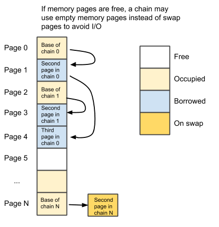
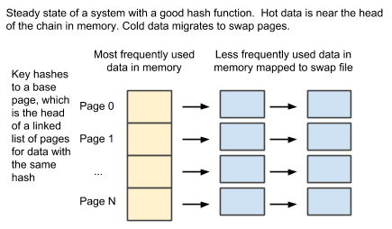

#Table of contents

* [Overview](#overview)
* [Data structures](#data-structures)
  * [Per keydir data](#per-keydir-data)
  * [Per page data](#per-page-data)
  * [Per chain data](#per-chain-data)
  * [Iterator visit data](#iterator-visit-data)
  * [Iterator data](#iterator-data)
  * [Entry data](#entry-data)
  * [File stats data](#file-stats-data)
* [Operations](#operations)
  * [Initial load](#initial-load)
  * [Read](#read)
  * [Write](#write)
  * [Delete](#delete)
  * [Iterator creation](#iterator-creation)
  * [Iterator next](#iterator-next)
  * [Iterator destruction](#iterator-destruction)
  * [Scanning a page chain](#scanning-a-page-chain)
  * [Compacting page chain](#compacting-page-chain)
  * [Allocate page](#allocate-page)
* [File statistics](#file-statistics)
* [Background processes](#background-statistics)
  * [Hit stats refresh sweep](#hit-stats-refresh-sweep)
  * [Janitor sweep](#janitor-sweep)
* [Potential future improvements](#potential-future-improvements)

# Overview

The main goal of this design is to replace the Bitcask keydir data structure with one that can handle key sets larger than memory.  Performance when the data set fits in memory should be comparable or better than the current solution.  When the data set is larger than memory, overall Bitcask performance should be comparable or superior to LevelDB.

This design allows concurrent access by many readers, writers and iterators.  The current keydir data structure has a single lock that allows only one operation on the keydir at a time. Here each page will have its own lock and the global keydir lock will only be held when modifying the keydir itself (for example, during iterator creation). Part of the performance benefit will require Riak and the rest of Bitcask to change to allow multiple operations to happen in parallel.

The main components of this design are:

* A memory buffer divided into equal sized pages.
* A fixed array of page records corresponding to each page in the buffer (entry N of the array corresponds to page N in memory order).
* A swap file logically divided into pages (same page size as memory pages).
* A dynamic array of swap page records each corresponding to pages on the swap file (entry N in the array corresponds to page N in file order).        
* A list of free memory pages.
* A list of infrequently accessed memory pages.
* A list of free swap pages.

Keys are assigned to one of the memory pages via hashing. Key entries are stored contiguously in the page.  When there is no more space in the page, more pages will be allocated and linked to this first page in a chain. Entries can be split across page boundaries. That way key size doesn’t have to be limited by the page size. Extra pages in the chain may come from the list of free pages, the list of infrequently used pages or the list of free swap pages, in that order.  If none of those lists have available pages, the swap file is expanded and the array of swap page records grows to match the file. Those new swap pages are then placed in the free swap page list. It is possible for a chain to start on a swap page if its corresponding memory page was very infrequently accessed and it ended up claimed by another chain.  In that case the base memory page stores the index of the swap page it has been moved to.

The idea is that, with a good hash function, hot and cold entries will very likely be spread evenly across all chains.  We want cold data to migrate towards the tail of the chain, so that it tends to reside in swap pages, while the most frequently accessed data resides in the base memory page.  To achieve data, data is compacted based on a heuristic to determine when it’s worth re-arranging entries to move the most accessed to the front.

Swap pages are memory mapped, so access to all pages is always done with regular memory accesses. Swap pages are never explicitly flushed to disk. The operating system will then manage these pages efficiently, keeping them in memory when possible and storing them on disk when not without using any intermediate I/O buffers.

If the memory buffer has N pages, and there are M pages in the swap file, the valid page index range is 0 -> N + M - 1. Pages 0 -> N -1 are in memory and pages N -> N + M - 1 are on swap.  The index order corresponds to the order of the pages in memory and in the swap file.

# Data structures

## Per keydir data

* **lock**: Protects modification to all keydir fields.
* **buffer**: Single buffer. Its size is a multiple of the page size
* **pages**: Array of page structs
* **swap_pages**: Dynamic list of pages stored in the swap file.
* **current_epoch**: 64 bit monotonic counter used to identify updates and iterators.
* **lowest_epoch**: lowest epoch among all folders or max epoch if none.
* **free_list_head**: index of first page in free list
* **underutilized_list_head**: pages not frequently accessed that can be claimed by frequently accessed disk pages if there are no more free pages.
* **iterator_epochs**: list of epochs corresponding to active iterators. Used to update lowest_epoch when an iterator is deleted.
* **file_stats**: Dynamic map of file stats maps. For each open or recently closed Bitcask instance, it contains a map of file -> file stats, and a global entry.  Each instance updates its set of file stats independently.  The call to get stats rolls all of those up into a single set of file stats, removing file stats maps for closed entries and rolling those into the global entry.

## Per page data

* **lock**: page mutex.
* **free flag**: Set if not currently used by any chain.
* **base_idx**: Index of the first page in the chain this page belongs to (could be itself).
* **prev_idx**: Index of previous page if page belongs to a free or unused chain.
* **next_idx** : index into next page if page belongs to a free or unused chain.
* **page_hits1**: # of times this page was accessed during this or previous period (alternates)
* **page_hits2**: # of times this page was accessed during this or previous period (alternates).
* **use_page_hits1** flag: Set when page_hits1 is the one updated in this interval, zero if its page_hits2 instead.

## Per chain data
Stored in the corresponding memory page structure.

* **size**: Number of bytes used in the chain (not just page). Owned by the chain owner and not valid to touch by page lock if the page is borrowed.
* **swap_idx**: If data for this page is located on a disk page, its index.
* **dead_bytes**: bytes in deleted and obsolete version entries (epoch < global min needed epoch).
* **visitor_list**: Dynamic list of entries, one per iterator currently parked on this page.
* **entry_offsets**:  For each entry, # of hits for both current and previous period
* **entry_hits1**: For each entry, # of hits in either current or previous period (it alternates). 
* **entry_hits2**: For each entry, # of hits in either current or previous period (it alternates)
* **use_entry_hits1** flag: Set when hits for current interval are stored in entry_hits1. Unset if those are stored in entry_hits2.
* **bloom_data**: Bloom filter bits to quickly determine if a key is not present in the chain. The price of scanning all pages, including those saved to disk, is too damn high!
* **min_epoch**: lowest epoch found on the chain starting on this page
* **max_epoch**: highest epoch in chain

## Iterator visit data

Data stored on a chain when an iterator is pointing to it.
* **offset**: Offset into the chain of pages where the iterator will resume scanning. May be reset all the way to zero if chain is re-arranged to move frequently used data to the front.   In that case the entries already visited but moved beyond the iterator offset are stored in the visited_offsets array.
* **visited_offsets**: Dynamic list of offsets of entries in the chain that have been visited already.  It is only created when a chain an iterator points to is compacted and entries rearranged. May be implemented as an ordered array to binary search over, or a hash if we have a decent number of keys in the chain. Benchmark to decide.

## Iterator data

* **epoch**: Defines a snapshot. Only entries with an epoch smaller than this are visible to the iterator.
* **page_idx**: Index of base page of chain being visited.

## Entry data

* **next**: offset of next version when storing multiple versions under the same key. Zero means no next version.
* **file_id**: One of the sequential ids assigned to bitcask dat files
* **offset**: Offset of the record in the data file
* **total_sz**: Size of the record in the data file.
* **obsolete flag**: Set if a more recent version exists and this version is needed by a snapshot (likely encoded as special codes in file/offset/sz).
* **epoch**: logical timestamp of last update to this entry.
* **tstamp**: System time of update (used for expiration).
* **key_sz**: Zero if a version entry (the key is only stored in the first version).
* **key**: key_sz bytes.

## File stats data

* **file_id**
* **live_keys**
* **live_bytes**
* **total_keys**
* **total_bytes**
* **oldest_tstamp**
* **newest_tstamp**
* **expiration_epoch**

# Operations

## Initial load

All pages are added to the free list. Shuffle pages in the list instead of adding them in order to avoid region bias.  Start at zero and skip N until you hit the end, then point at 1 and skip again, etc.

  

# Read

Hash key to locate base page. Lock first page of chain. 

**If the page has been moved to swap**, lock the swap entry instead and release the base memory page.

**If base page is in memory and it is empty**, we are done. Return not_found.

**If bloom filter says key is not present**, we are done. Return not_found.

**If bloom filter says key may be present**, scan chain to find first entry with this key.

**If the scan does not find the key**, we are done. Return not_found.

**If the scan finds a simple entry**, return that value.

**If the scan finds first multi-entry for the key**, follow next links to visit the rest of the multi-entries. If reading newest value, find the last multi-entry and return that. If reading from a snapshot, we can stop before reaching the end if it reaches a multi-entry with an epoch past the requested snapshot’s  epoch.

**Run compaction if needed**. See compaction section below. Consider doing this part asynchronously after returning result.

**Maybe relocate swap pages or remove accessed pages from underutilized list**.  See details in the page scanning section.

**Cleanup**. If we visited pages on swap, check if they can be loaded back to memory.  For each one, if the free list has pages, use one, copy contents to mem and free disk page entry.   If free list is empty but we have underutilized pages, we only want to swap a memory page out if heuristic determines some pages are not frequently accessed. Heuristic should weigh cost of copying a swap page that may be in memory anyway if in OS page cache, possibly displacing a page that will generate a page write when copied to swap.

Update hits count for all pages accessed.  If an entry was found, increment the current hits counter for its key.

# Write

First compute epoch for write by atomically incrementing the current_epoch. Fetch lowest epoch value in keydir. If lowest_epoch is bigger than this operation’s epoch, any entry can be updated in place as they are not needed by snapshots. Any snapshot requested after this point will see the new value we are writing and will not miss the value we are replacing since concurrently created iterators will not be able to lock and visit this chain until the new value has been written. If lowest_epoch is lower than the write epoch, then updates need to append an entry to the end of the chain.

Hash key to locate base page and lock it. If base page has been placed on the swap file instead, lock that swap page and release base memory page. 

**If bloom filter says the key is not present**, append the entry to the chain.

**If bloom filter says the key may be present**, scan page looking for key:

**If plain entry found**, update in place if possible. Otherwise update next field to point to the end of the chain and append entry to chain. 

**If multi-entry head found**, use the next entry in the multi-entry head to jump to the location of the next version of the multi-entry, allocating pages up the chain as necessary. Repeat until the the last version of this multi-entry is found.  For any entry with epoch not needed by snapshots, set the obsolete flag and update dead_bytes stats. Update in place if allowed. Otherwise point entry to tail of chain and append entry to chain.

**If scan reaches the end of the chain**, append entry to chain.

**Appending an entry**: Lock all remaining pages in chain order. If there is no space in the last page for this entry, allocate as many pages as necessary to fit the entry, chaining them together. Write new entry and update stats, bloom, etc.  Free any unused tail pages orphaned by compaction.  But if async is implemented, schedule compaction of this chain instead of performing it right away.

**Maybe remove base page from the free list**. If appending to an empty base page that was in the free list, it needs to be removed from it.  If the page is not the head of the list, that means unlocking it, locking the previous one in the list, locking the page again, and locking the next one in the free list. Sticking to this order should avoid two threads deadlocking here. This process may need to be retried if pages change (previous/next not pointing to our page anymore) or aborted if it is detected that another process already removed the page from the free list when it was accessed and discovered to already be in use.

**Maybe relocate swap pages or remove accessed pages from underutilized list**.  See details in the page scanning section.

# Delete

Just like a write, but if an entry is found it is marked as deleted. If the entry’s epoch is >= lowest_epoch it may be needed by an iterator, so add an extra tombstone version instead.

**Tricky**: Deleting data, then writing it again may create an entry that seems to have few hits, but actually it may be deleted and re-written a lot.  This depends on the frequency of the delete/writes, if they happen more frequently than deleted entry cleanup.  Yet another reason not to recommend delete/re-writes.

# Iterator creation

Compute iterator epoch by atomically incrementing current_epoch. Acquire keydir lock.   Add epoch to list of iterator epochs in keydir. If this epoch is < lowest_epoch, update lowest_epoch.  Release keydir lock.  

# Iterator next

Lock the base page the iterator points to*.  If the iterator has just been initialized, start with page zero and create iterator visit data. If the page has been moved to swap, look up that swap page and lock that one instead. Notice that the iterator data on the memory page is owned by the chain, so the lock on the base page on swap covers modifying that data, not the lock on the memory page that has been borrowed by another chain. Using the iterator data (looked up by iterator id/epoch), start scanning at the given offset of the chain. It may need to lock pages in the chain up to the one implied by the offset.  If a list of already visited offsets exists, use it to avoid revisiting entries.

*This is always a base page, not an intermediate page in the chain.  Pages might be compacted and removed from a chain in between iterator visits.  A page may even be moved from memory to swap in between visits.

# Iterator destruction

If iterator points to a page, lock it. Remove iterator data from page struct, unlock.

Acquire iterator mgmt lock. Remove iterator epoch from keydir.iterator_epochs, update lowest_epoch if needed. Release lock.

# Scanning a page chain

Entries in a page are scanned sequentially. Each entry has a fixed header and a variable sized keys, and they need to be aligned to 64 bit (8 byte) boundaries so accessing the fields is allowed.  After reaching the end of each page, if there is a next page go and lock it and continue there. Stop if no more pages. The code needs to handle reading entries that are split across page boundaries.

All pages accessed in the scan should have their page hits counter incremented.  Scanned pages currently in the underutilized list should be removed from it. Notice that a thread that is holding locks for a chain of pages is not allowed to try to acquire a page from the underutilized list if any of its own pages are themselves in the underutilized list. Allowing that could result in a deadlock.

**Maybe avoid I/O while pages are locked**: Consider unlocking all mem pages when accessing a swap page since it may incur disk I/O and locking mem pages for a long time may block iterator and background sweeps from making progress. Just try to acquire the locks again after page is accessed.  Restart operation if pages have changed since unlocked.

**Consider completing operation asynchronously if it may likely generate I/O**: Return and queue operation to be completed asynchronously as soon as a disk page is to be accessed (unless we can determine if it’s loaded in memory using the mincore system call or similar). Return to Erlang and have Erlang process block on until it receives the final result.

**Maybe move pages from swap to memory**: This is checked when reading, writing or deleting.  If there are free and/or underutilized pages, a heuristic should be used to decide to move data from swap to memory.  We would probably almost always do it if there are free pages. Highly utilized swap pages should likely replace underutilized pages in memory. A heuristic designed to avoid flapping may be used in this decision. That’s TBD.  This should probably be done asynchronously after returning a value if possible.

# Compacting page chain

Compacting a chain involves scanning all entries in the chain and rewriting them ordered by access frequency while dropping all obsolete data.

The heuristic to determine when that is necessary is TBD. Roughly it should detect a heavy imbalance in the access frequency of keys in the chain (say, N entries in swap pages are 4 times more frequently accessed than some entries in the first page), and/or good percentage of obsolete data in the chain. It must take into account the cost of messing with data in swap pages, which may generate I/O.

As usual, pages are locked in chain order as they are accessed to avoid deadlock. Most or all pages might be already locked when compaction is called on the chain. In the end, intermediate memory pages that are no longer used are placed in the free list, and intermediate swap pages that end up without data are placed in the swap free list. When a chain compacts to nothing, the base page should be placed in the free list.

# Allocating a page

If free list has entries, lock first entry. If page is no longer free, retry. If it is indeed free, atomically update free list head to point to next page. Return this page.

If the free list is empty, but the underutilized pages list has entries, try to fetch an underutilized page.  To avoid deadlocking when acquiring one, first make sure that no page in the chain is also in the underutilized list.  If two threads each lock on an underutilized page that the other has locked, we will deadlock. Now lock first underutilized page. If locked page has hits now, remove from underutilized list and retry.  If we get to lock a page that still has no hits, unlock, try to lock preceding page in its chain, then the same page again, then the next one (need to lock in chain order to avoid deadlock).  If middle page still has no hits, allocate a swap page and copy data to it. Change preceding and following pages to remove from its chain and return this page (after any needed cleanup).

# File statistics

Bitcask maintains per file statistics. They are protected by the single keydir lock.  To make updating them truly concurrently, they need to be accessed without a global lock.  Each Bitcask reference should contain its own file stats map that it can update independently. They keydir data structure will also have a pointer to the file stats map for each instance.  Each file stats map should have a reference count and a lock. When the Bitcask instance is closed, the reference count should go to 1.  

When stats are collected, the keydir lock is acquired, then for each file stats map in turn its lock is acquired and the data scanned.  If the instance has been closed (detected by looking at the reference count), it can be rolled into a global file stats structure and deleted.

# Background processes

## Hit stats refresh sweep

For each key, we keep track of how many times it has been accessed.  This is done in intervals, and we store information for two intervals: the current and previous.  That way, after a changeover we don’t start with just zero.  We know which keys were accessed frequently in the previous interval.

Periodically sweep across entire list of memory pages adjusting the hit statistics. For each chain, zero out previous interval hits array, which will now be used to store hits for the current interval.  The current interval’s hits array becomes the previous interval’s hits array.  

Latency warning: This operation doesn’t access page data, but would be affected by page locks being held by processes accessing disk.  We may want to release locks on memory pages when accessing swap pages that might fault and require access to page on disk (maybe use mincore here so we know whether the swap page is already in memory? if in memory, continue without unlocking?).

It also places any page that has not been accessed (or some heuristic indicated low frequency access) in the underutilized list.  This is a lockless list with the head stored in the keydir, so this is done with atomic CAS ops.

## Janitor sweep

Periodically sweeps entire keydir, scans chains to update dead/used byte counts and compacts chains if needed. 

# Potential future improvements

* Single buffer for all Bitcask instances? Very tempting, great simplifier.  Need a good per partition scanning algorithm to avoid scanning entire memory buffer for each partition.  Maybe a simple 64 bit bitmap for up to 64 partitions, fall off a cliff after 64? Or bit per ring partition?
* Is there a better way to load data initially than to load it in file order? Can we optimize to keep hot data in memory on next reload? Is it worth it only for quick reloads or never?
